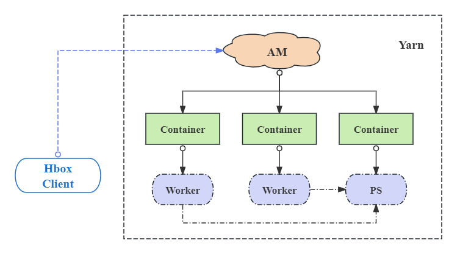

<br>
<div>
  <a href="https://github.com/Qihoo360/Hbox">
    
  </a>
</div>

[](./LICENSE)
[]()
[]()

We have renamed the repositiry from XLearning to hbox.

if you have a local clone of the repository, please update your remote URL:

```bash
git remote set-url origin https://github.com/Qihoo360/hbox.git
```

**Hbox** is a convenient and efficient scheduling platform combined with the big data and artificial intelligence, support for a variety of machine learning, deep learning frameworks. Hbox is running on the Hadoop Yarn and has integrated deep learning frameworks such as TensorFlow, MXNet, Caffe, Theano, PyTorch, Keras, XGBoost. Hbox has the satisfactory scalability and compatibility.

[**中文文档**](./README_CN.md)  


## Architecture
  
There are three essential components in Hbox:  

- **Client**: start and get the state of the application.  
- **ApplicationMaster(AM)**: the role for the internal schedule and lifecycle manager, including the input data distribution and containers management.  
- **Container**: the actual executor of the application to start the progress of Worker or PS(Parameter Server), monitor and report the status of the progress to AM, and save the output, especially start the TensorBoard service for TensorFlow application.  


## Functions
### 1 Support Multiple Deep Learning Frameworks  
Besides the distributed mode of TensorFlow and MXNet frameworks, Hbox supports the standalone mode of all deep learning frameworks such as Caffe, Theano, PyTorch. Moreover, Hbox allows the custom versions and multi-version of frameworks flexibly.  


### 2 Unified Data Management Based On HDFS  
Hbox is enable to specify the input strategy for the input data `--input` by setting the `--input-strategy` parameter or `hbox.input.strategy` configuration. Hbox support three ways to read the HDFS input data:  

- **Download**: AM traverses all files under the specified HDFS path and distributes data to workers in files. Each worker download files from the remote to local.  
- **Placeholder**: The difference with Download mode is that AM send the related HDFS file list to workers. The process in worker read the data from HDFS directly.   
- **InputFormat**: Integrated the InputFormat function of MapReduce, Hbox allows the user to specify any of the implementation of InputFormat for the input data. AM splits the input data and assigns fragments to the different workers. Each worker passes the assigned fragments through the pipeline to the execution progress.   

Similar with the read strategy, Hbox allows to specify the output strategy for the output data `--output` by setting the `--output-strategy` parameter or `hbox.output.strategy` configuration. There are two kinds of result output modes:  

- **Upload**: After the program finished, each worker upload the local directory of the output to specified HDFS path directly. The button, "Saved Model", on the web interface allows user to upload the intermediate result to remote during the execution.  
- **OutputFormat**: Integrated the OutputFormat function of MapReduce, Hbox allows the user to specify any of the implementation of OutputFormat for saving the result to HDFS.    

More detail see [**data management**](./doc/datamanage_cn.md)    

### 3 Visualization Display  
The application interface can be divided into four parts:  

- **All Containers**：display the container list and corresponding information, including the container host, container role, current state of container, start time, finish time, current progress.
- **View TensorBoard**：If set to start the service of TensorBoard when the type of application is TensorFlow, provide the link to enter the TensorBoard for real-time view.  
- **Save Model**：If the application has the output, user can upload the intermediate output to specified HDFS path during the execution of the application through the button of "Save Model". After the upload finished, display the list of the intermediate saved path.   
- **Worker Metrix**：display the resource usage information metrics of each worker.   
  As shown below:   

 


### 4 Compatible With The Code At Native Frameworks  
Except the automatic construction of the ClusterSpec at the distributed mode TensorFlow framework, the program at standalone mode TensorFlow and other deep learning frameworks can be executed at Hbox directly.  


## Compilation & Deployment Instructions

### 1 Compilation Environment Requirements 

- jdk >= 1.7
- Maven >= 3.3

### 2 Compilation Method 

Run the following command in the root directory of the source code:  

`mvn package`    

After compiling, a distribution package named `hbox-1.1-dist.tar.gz` will be generated under `target` in the root directory.   
Unpacking the distribution package, the following subdirectories will be generated under the root directory:

- bin: scripts for application commit  
- lib: jars for Hbox and dependencies  
- conf: configuration files  
- sbin: scripts for history service  
- data: data and files for examples
- examples: Hbox examples


### 3 Deployment Environment Requirements  

- CentOS 7.2  
- Java >= 1.7
- Hadoop = 2.6, 2.7, 2.8
- [optional] Dependent environment for deep learning frameworks at the cluster nodes, such as TensorFlow, numpy, Caffe.  


### 4 Hbox Client Deployment Guide  
Under the "conf" directory of the unpacking distribution package "$HBOX_HOME", configure the related files:  

- hbox-env.sh: set the environment variables, such as:  
  + JAVA\_HOME  
  + HADOOP\_CONF\_DIR    

- hbox-site.xml: configure related properties. Note that the properties associated with the history service needs to be consistent with what has configured when the history service started.For more details, please see the [**Configuration**](./doc/configure.md) part。  

- log4j.properties：configure the log level  


### 5 Start Method of Hbox History Service [Optional]     

- run `$HBOX_HOME/sbin/start-history-server.sh`.  


## Quick Start

Use `$HBOX_HOME/bin/xl-submit` to submit the application to cluster in the Hbox client.   
Here are the submit example for the TensorFlow application.
### 1 upload data to hdfs  
upload the "data" directory under the root of unpacking distribution package to HDFS  

    cd $HBOX_HOME  
    hadoop fs -put data /tmp/ 

### 2 submit
    cd $HBOX_HOME/examples/tensorflow
    $HBOX_HOME/bin/xl-submit \
       --app-type "tensorflow" \
       --app-name "tf-demo" \
       --input /tmp/data/tensorflow#data \
       --output /tmp/tensorflow_model#model \
       --files demo.py,dataDeal.py \
       --launch-cmd "python demo.py --data_path=./data --save_path=./model --log_dir=./eventLog --training_epochs=10" \
       --worker-memory 10G \
       --worker-num 2 \
       --worker-cores 3 \
       --ps-memory 1G \
       --ps-num 1 \
       --ps-cores 2 \
       --queue default \


The meaning of the parameters are as follows:  

| Property Name | Meaning                                  |
| ------------- | ---------------------------------------- |
| app-name      | application name as "tf-demo"            |
| app-type      | application type as "tensorflow"         |
| input         | input file, HDFS path is "/tmp/data/tensorflow" related to local dir "./data" |
| output        | output file，HDFS path is "/tmp/tensorflow_model" related to local dir "./model" |
| files         | application program and required local files, including demo.py, dataDeal.py |
| launch-cmd    | execute command                          |
| worker-memory | amount of memory to use for the worker process is 10GB |
| worker-num    | number of worker containers to use for the application is 2 |
| worker-cores  | number of cores to use for the worker process is 3 |
| ps-memory     | amount of memory to use for the ps process is 1GB |
| ps-num        | number of ps containers to use for the application is 1 |
| ps-cores      | number of cores to use for the ps process is 2 |
| queue         | the queue that application submit to     |


For more details, set the [**Submit Parameter**](./doc/submit.md) part。  


## FAQ
[**Hbox FAQ**](./doc/faq.md)


## Authors

`Hbox` is designed, authored, reviewed and tested by the team at the github:  

  [@Yuance Li](http://github.com/liyuance), [@Wen OuYang](http://github.com/ouyangwen-it), [@Runying Jia](http://github.com/jiarunying), [@YuHan Jia](http://github.com/jiayuhan-it), [@Lei Wang](http://github.com/wangleibefree)  


## Contact us


