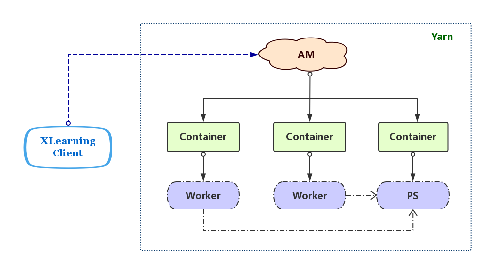
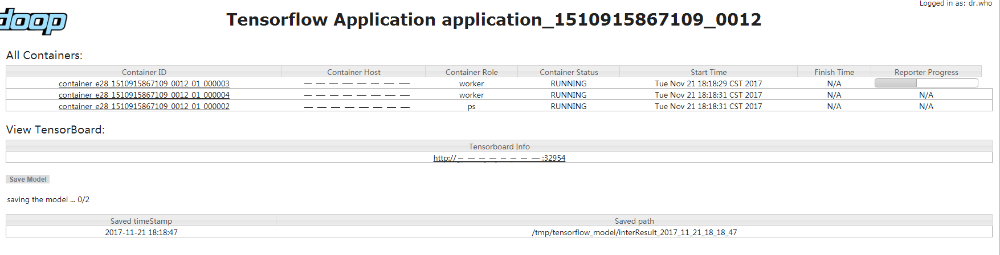

 

  

  

**XLearning**是一款支持多种机器学习、深度学习框架的调度系统。基于Hadoop Yarn完成了对TensorFlow、MXNet、Caffe、Theano、PyTorch、Keras、XGBoost等常用框架的集成，同时具备良好的扩展性和兼容性。  

[**English Document**](./README.md)

## 架构设计

XLearning系统包括三种组件：  

- **Client**：XLearning客户端，负责启动作业及获取作业执行状态；  
- **ApplicationMaster（AM）**：负责输入数据分片、启动及管理Container、执行日志保存等；    
- **Container**：作业的实际执行者，负责启动Worker或PS（Parameter Server）进程，监控并向AM汇报进程状态，上传作业的输出等。对于TensorFlow类型作业，还负责启动TensorBoard服务。

## 功能特性
### 1 支持多种深度学习框架  
支持TensorFlow、MXNet分布式和单机模式，支持所有的单机模式的深度学习框架，如Caffe、Theano、PyTorch等。对于同一个深度学习框架支持多版本和自定义版本。

### 2 基于HDFS的统一数据管理  
训练数据和模型结果统一采用HDFS进行存储，用户可通过`--input-strategy`或`xlearning.input.strategy`指定输入数据所采用的读取方式。目前，XLearning支持如下三种HDFS输入数据读取方式：  
- **Download**： AM根据用户在提交脚本中所指定的输入数据参数，遍历对应HDFS路径下所有文件，以文件为单位将输入数据平均分配给不同Worker。在Worker中的执行程序对应进程启动之前，Worker会根据对应的文件分配信息将需要读取的HDFS文件下载到本地指定路径； 
- **Placeholder**： 与Download模式不同，Worker不会直接下载HDFS文件到本地指定路径，而是将所分配的HDFS文件列表通过环境变量`INPUT_FILE_LIST`传给Worker中的执行程序对应进程。执行程序从环境变量`os.environ["INPUT_FILE_LIST"]`中获取需要处理的文件列表，直接对HDFS文件进行读写等操作。该模式要求深度学习框架具备读取HDFS文件的功能，或借助第三方模块库如pydoop等。  
- **InputFormat**： XLearning集成有MapReduce中的InputFormat功能。在AM中，根据“split size”对所提交脚本中所指定的输入数据进行分片，并均匀的分配给不同Worker。在Worker中，根据所分配到的分片信息，以用户指定的InputFormat类读取数据分片，并通过管道将数据传递给Worker中的执行程序进程。

同输入数据读取类似，用户可通过`--output-strategy`或`xlearning.output.strategy`指定输出结果的保存方式。XLearning支持如下两种结果输出保存模式：  
- **Upload**： 执行程序结束后，Worker根据提交脚本中输出数据参数，将本地输出路径保存文件上传至对应HDFS路径。为方便用户在训练过程中随时将本地输出上传至HDFS，XLearning系统在作业执行Web界面提供对输出模型的当前状态主动保存的功能，详情请见“可视化界面”说明部分；  
- **OutputFormat**： XLearning集成有MapReduce中的OutputFormat功能。在训练过程中，Worker根据指定的OutputFormat类，将结果输出至HDFS。  

### 3 可视化界面  
作业运行界面大致分为四部分：  

- **All Containers**：显示当前作业所含Container列表及各Container对应信息，如Contianer ID、所在机器（Container Host）、所属类型（Container Role）、当前执行状态（Container Status）、开始时间（Start Time）、结束时间（Finish Time）、执行进度（Reporter Progress）。其中，点击Container ID超链接可查看该Container运行的详细日志；
- **View TensorBoard**：当作业类型为TensorFlow时，可点击该链接直接跳转到TensorBoard页面；  
- **Save Model**：当作业提交脚本中“--output”参数不为空时，用户可通过`Save Model`按钮，在作业执行过程中，将本地输出当前模型训练结果上传至HDFS。上传成功后，显示目前已上传的模型列表；  
- **Worker Metrix**：显示各worker执行所占用的资源信息。 
  
如下图所示：
  
 

### 4 原生框架代码的兼容性  
  TensorFlow分布式模式支持“ClusterSpec”自动分配构建，单机模式和其他深度学习框架代码不用做任何修改即可迁移到XLearning上。

## 编译&部署指南

### 1 编译环境依赖 

- jdk >= 1.8
- Maven >= 3.3

### 2 编译方法  

在源码根目录下，执行:  

`mvn package`

完成编译后，在源码根目录下的target目录中会生成发布包`xlearning-1.1-dist.tar.gz`。该发布包解压后的主要目录结构如下：  

- bin：作业提交脚本  
- lib：XLearning jar包及所依赖jar包  
- conf：XLearning配置文件  
- sbin：XLearning History Server启动脚本  
- data：运行示例所需输入数据和文件  
- examples：运行示例  

### 3 部署环境依赖  

- CentOS 7.2  
- Java >= 1.8
- Hadoop = 3.1.0 [目前社区未发正式版，为3.1.0-SNAPSHOT，详细说明可见3.1]
- [可选]各计算节点具有所需学习平台的依赖环境，如TensorFlow、numpy、Caffe等。
- nvidia-smi : 用于获取gpu信息  

#### 3.1 Hadoop 3.1.0-SNAPSHOT 集群配置注意事项
`xlearning-gpu-beta` 版本中的gpu申请分配功能是基于 `hadoop3.1.0-SNAPSHOT` 版本中的gpu调度隔离功能来实现的。在使用 `hadoop3.1.0-SNAPSHOT` 版本中gpu资源的调度隔离时，需要注重以下几个方面：  
- 所需java版本为1.8  
- 因gpu资源采用cgroup实现的隔离，`yarn.nodemanager.container-executor.class`需要配置为`org.apache.hadoop.yarn.server.nodemanager.LinuxContainerExecutor`，并进行相关设置。注意将下述配置添加到`container-executor.cfg`中；  

      [gpu]   
      module.enabled=true   

- 采用默认的资源调度策略`CapacityScheduler`，注意设置`yarn.scheduler.capacity.resource-calculator`为`org.apache.hadoop.yarn.util.resource.DominantResourceCalculator`；  
- 配置gpu资源信息：  
1）yarn-site.xml 中配置类似如下：  

      <!-- resource -->
      <property>
        <name>yarn.nodemanager.resource-plugins</name>
        <value>yarn.io/gpu</value>
      </property>
      <property>
        <name>yarn.nodemanager.resource-plugins.gpu.allowed-gpu-devices</name>
        <value>auto</value>
      </property>

2）resource-types.xml 中配置类似如下：  

      <configuration>
        <property>
          <name>yarn.resource-types</name>
          <value>yarn.io/gpu</value>
        </property>
      </configuration>

### 4 XLearning客户端部署方法  
在XLearning发布包根目录$XLEARNING_HOME下的conf目录中，分别配置如下文件：

- xlearning-env.sh：设置相关环境变量，如：
  + JAVA\_HOME  
  + HADOOP\_CONF\_DIR    

- xlearning-site.xml：详细系统配置说明请见[**配置参数**](./doc/configure_cn.md)部分。
  
- log4j.properties：配置日志级别  

### 5 XLearning History Server启动方法 [可选]    

- 执行`$XLEARNING_HOME/sbin/start-history-server.sh`

## 运行示例

在XLearning客户端，使用`$XLEARNING_HOME/bin/xl-submit`提交脚本将作业提交至Yarn集群。
以TensorFlow作业提交为例：
### 1 上传训练数据至hdfs路径  
将发布包解压后的data文件夹上传至hdfs，如：  

    cd $XLEARNING_HOME
    hadoop fs -put data /tmp/ 
    
### 2 提交运行
     cd $XLEARNING_HOME/examples/tensorflow
     $XLEARNING_HOME/bin/xl-submit \
       --app-type "tensorflow" \
       --app-name "tf-demo" \
       --input /tmp/data/tensorflow#data \
       --output /tmp/tensorflow_model#model \
       --files demo.py,dataDeal.py \
       --launch-cmd "python demo.py --data_path=./data --save_path=./model --log_dir=./eventLog --training_epochs=10" \
       --worker-memory 10G \
       --worker-num 2 \
       --worker-cores 3 \
       --worker-gcores 1 \
       --ps-memory 1G \
       --ps-num 1 \
       --ps-cores 2 \
       --queue default \
       

提交脚本各参数含义如下：  

参数名称 | 含义  
---------------- | ---------------  
app-name | 作业名称为 "tf-demo"  
app-type | 作业类型为 "tensorflow"  
input | 输入文件，HDFS路径：/tmp/data/tensorflow，对应本地路径./data  
output | 输出文件，HDFS路径：/tmp/tensorflow_model，对应本地路径./model  
files | 需要传给各container的本地文件，包括 demo.py、dataDeal.py  
launch-cmd | 训练执行命令  
worker-memory | worker内存使用为10G  
worker-num | worker数目为2  
worker-cores | worker使用CPU核数为3
worker-gcores | worker使用GPU卡数为1
ps-memory | parameterServer内存使用为1G  
ps-num | parameterServer数目为1  
ps-cores | parameterServer使用CPU核数为2  
queue | 作业提交队列    

更多相关参数详细说明请见[**运行提交参数**](./doc/submit_cn.md)部分。  

## FAQ
[**XLearning常见问题**](./doc/faq_cn.md)

## 联系我们
Mail： <g-xlearning-dev@360.cn>     
QQ群：588356340  

